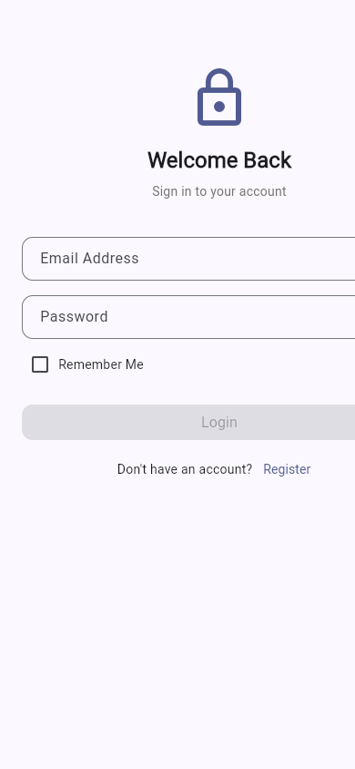
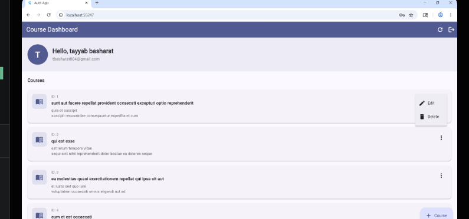
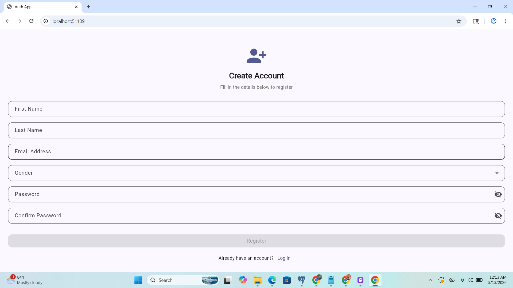
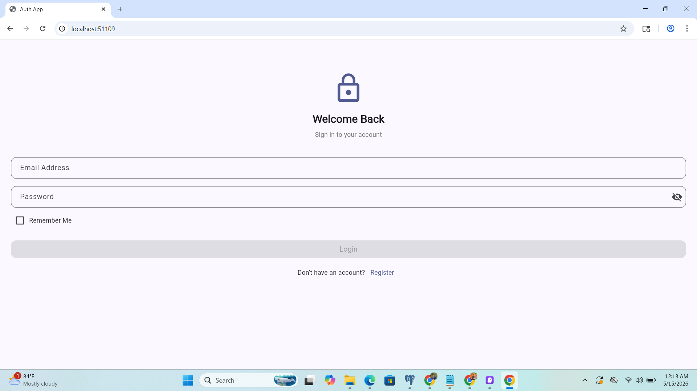
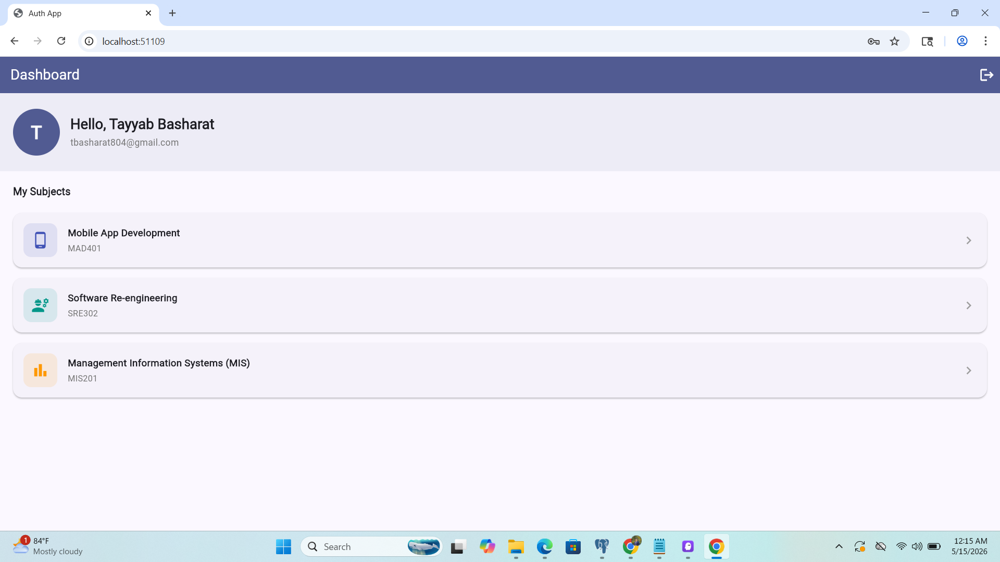
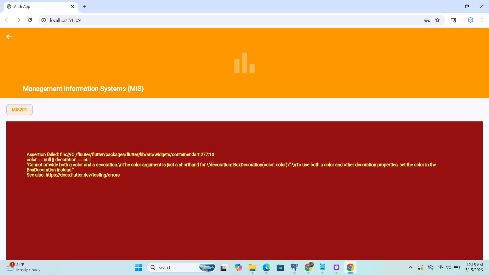

# Auth App — Flutter Assignment

## Student Information

| Field | Value |
|-------|-------|
| **Name** | Tayyab Basharat |
| **Student ID** | SE-221048 |
| **Repository** | https://github.com/tayyabbasharat127/Auth-app.git |

---

# Part 2 — Offline Cache, State Management & Repository Pattern

## Branch Name

```
feature/offline-cache-and-state-manangement
```

**Branch Link:** https://github.com/tayyabbasharat127/Auth-app/tree/feature/offline-cache-and-state-manangement

---

## Tools and Packages Used

| Package | Version | Role |
|---------|---------|------|
| `provider` | ^6.1.2 | State management — `ChangeNotifier` + `Consumer<T>` |
| `hive_flutter` | ^1.1.0 | Offline-first local storage (persistent Hive box) |
| `connectivity_plus` | ^6.0.0 | Real-time network connectivity detection |
| `http` | ^1.6.0 | REST API calls to JSONPlaceholder |
| `shared_preferences` | ^2.2.2 | Auth session persistence (login / remember me) |

---

## Architecture Explanation

The extension introduces a strict 4-layer architecture with clear separation of concerns.

```
┌─────────────────────────────────────────────────────┐
│                   UI Layer                          │
│   DashboardScreen  ←  Consumer<CourseProvider>      │
└───────────────────────┬─────────────────────────────┘
                        │ reads / calls
┌───────────────────────▼─────────────────────────────┐
│              State Management Layer                 │
│   CourseProvider  (ChangeNotifier)                  │
│   • CourseStatus enum: initial/loading/success/     │
│     empty/error                                     │
│   • Optimistic CRUD with rollback                   │
│   • Live search filter                              │
└───────────────────────┬─────────────────────────────┘
                        │ calls
┌───────────────────────▼─────────────────────────────┐
│               Repository Layer                      │
│   CourseRepository                                  │
│   • Decides: online → API, offline → Hive cache     │
│   • Falls back to cache on API failure              │
└──────────┬────────────────────────────┬─────────────┘
           │                            │
┌──────────▼──────────┐   ┌────────────▼────────────┐
│   API Service       │   │   Local DataSource      │
│   CourseService     │   │   CourseLocalDataSource │
│   (HTTP only)       │   │   (Hive box, JSON)      │
└─────────────────────┘   └─────────────────────────┘
```

### File Structure Added

```text
lib/
├── local/
│   └── course_local_datasource.dart   ← Hive read / write / cache
├── repositories/
│   └── course_repository.dart         ← online-vs-offline decision
├── providers/
│   └── course_provider.dart           ← ChangeNotifier state machine
```

### Separation of Concerns

| Layer | File | Responsibility |
|-------|------|---------------|
| HTTP | `CourseService` | API calls only — no cache, no UI knowledge |
| Cache | `CourseLocalDataSource` | Hive box operations — no business logic |
| Data | `CourseRepository` | Picks API or cache; caches fresh results |
| State | `CourseProvider` | Drives UI state, optimistic updates, search |
| UI | `DashboardScreen` | Pure display — reads state via `Consumer` |

---

## Offline Support Explanation

### How it works

1. **Online** — `CourseRepository` calls the API, saves the response to a Hive box as a JSON string, then returns the fresh list.
2. **Offline** — `connectivity_plus` detects no network before the API call. The repository reads the Hive cache immediately and returns it without attempting the network.
3. **API failure while online** — if the request throws (timeout, server error), the repository silently falls back to the Hive cache instead of propagating an error.

### Synchronisation

When the user taps **Retry** on the offline banner, `CourseProvider.loadCourses()` runs again. If the device is now connected the API is called, the Hive cache is refreshed, and the banner disappears.

### Hive initialisation

Hive is initialised in `main()` **before** `runApp()` so the box is open and available before the first widget tree is built:

```dart
await Hive.initFlutter();
await CourseLocalDataSource.init();   // opens the Hive box
runApp(MyApp(...));
```

---

## State Management Explanation

### Provider + ChangeNotifier

`CourseProvider` is a `ChangeNotifier` registered at the app root in `MultiProvider`. Every screen below the root can read or watch it via `context.read<CourseProvider>()` / `Consumer<CourseProvider>` without prop drilling.

### CourseStatus enum

```dart
enum CourseStatus { initial, loading, success, error, empty }
```

The dashboard reacts to each state:

| Status | UI shown |
|--------|----------|
| `initial` | nothing (load not yet triggered) |
| `loading` | spinner (full-screen on first load, inline chip on refresh) |
| `success` | course list |
| `empty` | illustrated empty-state message |
| `error` | error message + Try Again button |

### Optimistic UI Updates

All CRUD mutations update the local list **immediately** before awaiting the API call:

- **Add** — a placeholder course (temp negative ID) is prepended instantly; replaced by the real API response on success.
- **Update** — card reflects the new values immediately; reverts to old values if the API fails.
- **Delete** — card disappears instantly; re-inserted at its original index if the API fails.

On any failure an error snackbar is shown and the error is cleared from the provider.

---

## UX Improvements

| Feature | How |
|---------|-----|
| Pull-to-refresh | `RefreshIndicator` wraps the `ListView`, calls `loadCourses()` |
| Live search / filter | `TextField` above list; filters by title or description in memory — no extra API call |
| Offline banner | Orange bar at top of dashboard when data came from cache; includes Retry button |
| Empty state | Illustrated message when list is empty or no search results match |
| Per-card busy indicator | Individual `CircularProgressIndicator` on the card being edited / deleted |

---

## Screenshots

### Course Dashboard & Detail (Extension)

| Course Dashboard | Course Detail |
|-----------------|--------------|
|  |  |

### Authentication Screens (Base App)

| Register | Login |
|----------|-------|
|  |  |

| Dashboard | Detail |
|-----------|--------|
|  |  |

---

---

# Part 1 — Base Flutter Application

## Project Overview

A multi-screen Flutter authentication app with registration, login, dashboard, and detail screens. Includes form validation, enum-based state, controller-based business logic, and full CRUD integration with the JSONPlaceholder REST API.

## Application Screens

### 1. Registration Screen

Required fields: First Name, Last Name, Email, Gender (dropdown), Password, Confirm Password.

Password rules: minimum 6 characters, 1 uppercase letter, 1 special character.

Validation is shown in real time. On success, a confirmation dialog navigates the user to Login.

### 2. Login Screen

- Email + password validation
- Show / hide password toggle
- Remember Me checkbox → persists session via `SharedPreferences`
- Navigates to Dashboard on success

### 3. Dashboard Screen

Displays the logged-in user's name, email, and avatar initial. Lists courses fetched from the API with full CRUD support (add, edit, delete, view detail). Includes logout.

### 4. Detail Screen

`CustomScrollView` with a `SliverAppBar` expanding header. Displays course title, description, and user ID in a read-only view.

## Course API

- Base URL: `https://jsonplaceholder.typicode.com`
- Endpoint: `/posts` (4 records fetched with `?_limit=4`)

| Operation | Method | Endpoint |
|-----------|--------|----------|
| Read | GET | `/posts?_limit=4` |
| Create | POST | `/posts` |
| Update | PUT | `/posts/{id}` |
| Delete | DELETE | `/posts/{id}` |

JSONPlaceholder simulates responses but does not persist data server-side; the app manages state locally.

## Project Structure

```text
lib/
├── main.dart
├── controllers/
│   └── auth_controller.dart
├── local/
│   └── course_local_datasource.dart
├── models/
│   ├── course_model.dart
│   ├── subject_model.dart
│   └── user_model.dart
├── providers/
│   └── course_provider.dart
├── repositories/
│   └── course_repository.dart
├── screens/
│   ├── course_form_screen.dart
│   ├── dashboard_screen.dart
│   ├── detail_screen.dart
│   ├── login_screen.dart
│   └── register_screen.dart
├── services/
│   └── course_service.dart
├── utils/
│   └── validators.dart
└── widgets/
    └── app_text_field.dart
```

## Getting Started

```bash
flutter pub get
flutter run
```

Requires Flutter SDK >= 3.0.0.

## Submission Checklist

- [x] Complete Flutter project source code
- [x] Branch `feature/offline-cache-and-state-manangement` created
- [x] Tools and packages documented
- [x] Architecture explanation included
- [x] Offline support explanation included
- [x] State management explanation included
- [x] Screenshots included
- [x] GitHub repository link included
- [x] Student name and ID included
- [x] Project runs without errors (`flutter analyze` — no issues)
